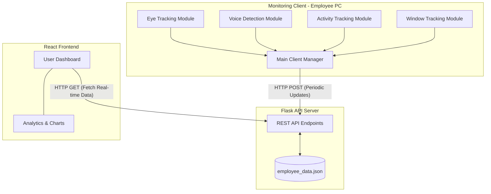
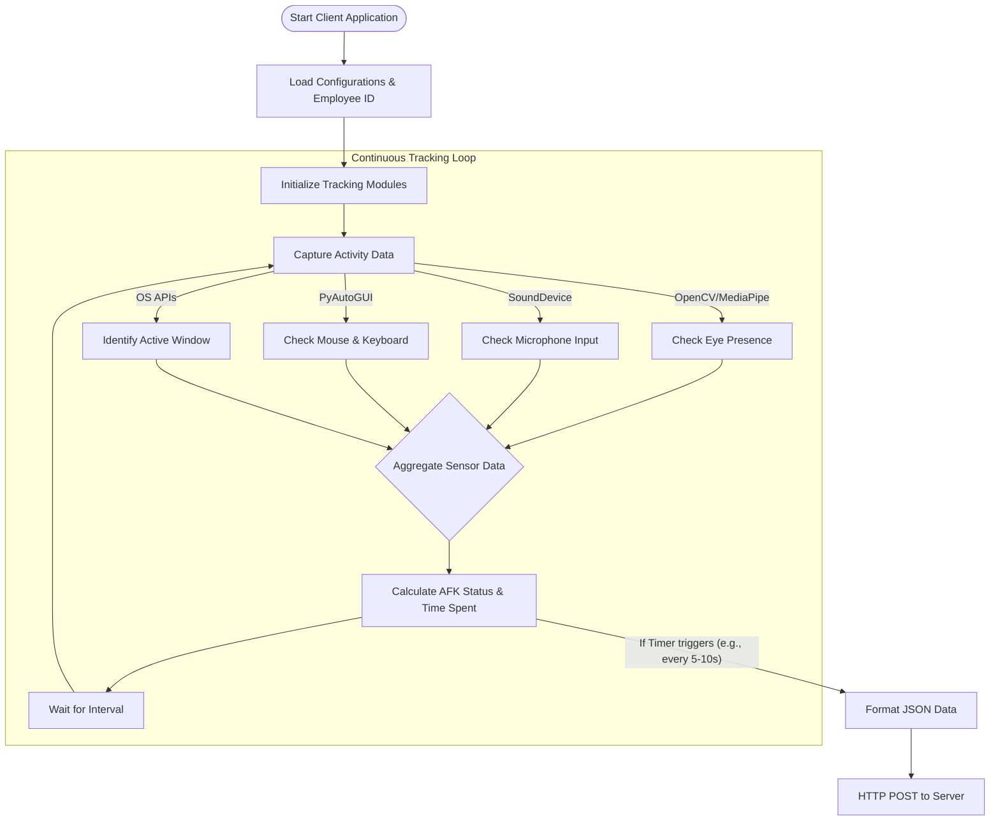

# Hackaway AFK Guardian - Workflow & Architecture

This document provides a comprehensive overview of the **AFK Guardian** project's workflow and architecture. The system is designed to monitor employee activity through various trackers, process the data on a central server, and present it via a user-friendly dashboard.

## 1. High-Level Architecture

The system follows a modular, client-server architecture consisting of three main components: a Desktop Client, a Backend API Server, and a React-based Web Dashboard.

### Text-Based Block Diagram

```text
+-----------------------+              +-------------------+              +-----------------------+
|  Monitoring Client    |              |  Backend Server   |              |  Web Dashboard        |
|  (Employee PC)        |              |  (Flask API)      |              |  (React Frontend)     |
|                       |              |                   |              |                       |
|  [Eye Tracker]        |  HTTP POST   |  [REST API]       |   HTTP GET   |  [User Interface]     |
|  [Voice Tracker]      | -----------> |  [employee_data]  | <----------- |  [Charts & Analytics] |
|  [Activity Tracker]   |  (Periodic   |                   |   (Real-time |                       |
|  [Window Tracker]     |   Updates)   |                   |    Refresh)  |                       |
+-----------------------+              +-------------------+              +-----------------------+
```

### Flowchart (Mermaid)



## 2. Client Monitoring Workflow

The client application runs continuously in the background on the employee's machine. It aggregates data from multiple sensors to determine if the user is actively working or "Away From Keyboard" (AFK).

### Text-Based Block Diagram

```text
       [Start Client Application]
                  |
                  v
[Load Configurations & Employee ID]
                  |
                  v
    [Initialize Tracking Modules]
                  |
                  v
  +-----------------------------------+
  |      Continuous Tracking Loop     |
  |                                   |
  |  [Capture Activity Data]          |
  |      |        |        |          |
  |      v        v        v          |
  |   [Eye]    [Voice]  [Activity]    |
  |      |        |        |          |
  |      +------> + <------+          |
  |               |                   |
  |               v                   |
  |  [Aggregate Sensor Data]          |
  |               |                   |
  |               v                   |
  |  [Calculate AFK Status & Time]    |
  |               |                   |
  |               v                   |
  |       [Wait for Interval] --------+-- (Loops back to Capture)
  |                                   |
  +---------------+-------------------+
                  |
                  v (Every X sec)
          [Format JSON Data]
                  |
                  v
       [HTTP POST to Server]
```

### Flowchart (Mermaid)



## 3. Data Flow & Update Cycle

Data originates from the physical interactions of the employee and flows all the way to the frontend dashboard. 

### Text-Based Data Flow

```text
 1. EMPLOYEE  ---> (Physical Actions: Typing, Looking at Screen, Speaking)
                   |
 2. CLIENT    <--- (Captures Actions & Calculates Status every second)
                   |
 3. SERVER    <--- (Receives Activity Stats via HTTP POST periodically)
                   |
 4. STORAGE   <--- (Server reads & writes to 'employee_data.json')
                   |
 5. DASHBOARD <--- (Periodically fetches data via HTTP GET from Server)
                   |
 6. ADMIN     <--- (Views Real-time Charts & Timelines updated on Dashboard)
```

## 4. Component Details

1. **Monitoring Client (`clients/`)**:
   - Built with Python. Uses libraries like OpenCV and MediaPipe for vision validation, `sounddevice` for audio checking, and PyAutoGUI to track system inputs. 
   - Responsible for determining *local* state (Active, In Meeting, AFK) directly on the client to minimize network bandwidth and preserve privacy, sending only abstract metrics as a lightweight JSON payload.
   
2. **Backend API (`server/`)**:
   - A lightweight Python Flask application serving simple REST endpoints (`GET` and `POST`).
   - Maintains state within `employee_data.json` locally, making it highly portable and avoiding complex database requirements.
   
3. **Frontend Dashboard (`frontend/`)**:
   - Built with React and Tailwind CSS.
   - Designed to fetch data from the server API and visualize employee activity using charts and timelines (e.g., using Recharts), giving administrators a high-level view of productivity.
